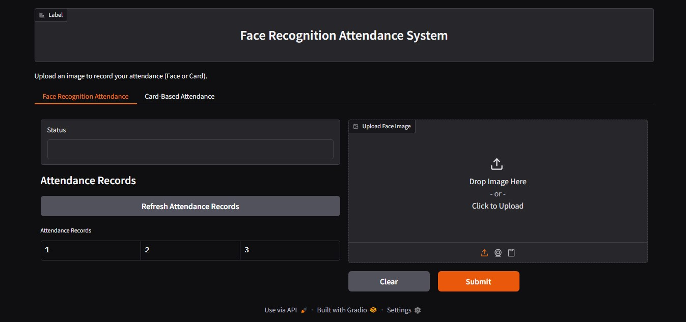

# Face Recognition & Card-Based Attendance System

This project implements a dual-mode attendance system using:
- **Face Recognition** (ArcFace + classifier)
- **Card-Based Attendance** (OCR extraction of registration/roll number)

with a modern Gradio interface.



## Table of Contents

- [Project Overview](#project-overview)
- [Technical Stack](#technical-stack)
- [Coding Guidelines](#coding-guidelines)
- [Attendance Logic](#attendance-logic)
- [Testing & Validation](#testing--validation)
- [Deployment Guidelines](#deployment-guidelines)
- [File Structure](#file-structure)
- [Setup](#setup)
- [Additional Notes](#additional-notes)

## Project Overview

- **Objective**: Develop an attendance system that supports:
  - **Face Recognition**: Mark attendance by recognizing a student's face.
  - **Card-Based Attendance**: Mark attendance by extracting the registration/roll number from a student card using OCR.
- **Dataset**: 10+ facial images per student, organized in `dataset/student_id/` folders.
- **Model**: Uses ArcFace (InsightFace) for face embeddings and a trained classifier for student recognition.
- **OCR**: Uses Tesseract-OCR (via pytesseract) to extract registration numbers from card images.

## Technical Stack

- **Programming Language**: Python 3.10+
- **Libraries & Frameworks**:
  - `insightface`, `scikit-learn`: For ArcFace embeddings and classification.
  - `pytesseract`: For OCR from card images.
  - `torch`, `torchvision`: For deep learning operations.
  - `gradio`: For the user interface.
  - `PIL` (Python Imaging Library): For image processing.
  - `pandas`, `numpy`: For data handling.

## Coding Guidelines

- **Code Structure**: Modularized into separate files:
  - `data_loader.py`: Handles data loading and preprocessing.
  - `model.py`: (Legacy) ViT-based face recognition (not used by default).
  - `arcface_recognition.py`: ArcFace-based face recognition logic.
  - `card_attendance.py`: Card-based attendance using OCR.
  - `attendance.py`: Manages attendance logic and record-keeping.
  - `app.py`: Integrates all modules and runs the Gradio interface.
- **Naming Conventions**: `snake_case` for functions and variables, `PascalCase` for classes.
- **Documentation**: Docstrings for all functions and classes, comments for complex logic.
- **Error Handling**: Try-except blocks and error logging.

## Attendance Logic

- **Recognition Flow**:
  1. User uploads a face or card image.
  2. The system processes the image:
     - **Face Tab**: Predicts the student's identity using ArcFace + classifier.
     - **Card Tab**: Extracts registration/roll number using OCR.
  3. The system checks the attendance record:
     - If the student hasn't checked in today: Record check-in timestamp.
     - If the student has checked in but not out: Record check-out timestamp.
     - If both recorded: Notify attendance is complete for the day.
- **Data Storage**: Attendance records are maintained in `attendance_records.csv`.

## Testing & Validation

- **Test Cases**: Validate both face and card recognition, test attendance logic scenarios.
- **Performance Metrics**: Monitor model accuracy, OCR extraction accuracy, and system response time.

## Deployment Guidelines

- **Gradio Interface**: User-friendly interface with two tabs:
  - **Face Recognition Attendance**: Upload a face image.
  - **Card-Based Attendance**: Upload a card image.
- **Tesseract-OCR**: Must be installed and available in your system PATH for card-based attendance.
- **Dependencies**: Listed in `requirements.txt`.

## File Structure

```
project_root/
├── data_loader.py
├── model.py
├── arcface_recognition.py
├── card_attendance.py
├── attendance.py
├── app.py
├── requirements.txt
├── dataset/
│   ├── student_1/
│   │   ├── img1.jpg
│   │   └── ...
│   └── student_n/
│       ├── img1.jpg
│       └── ...
├── attendance_records.csv
├── arcface_classifier.joblib
├── arcface_labels.joblib
├── arcface_embeddings.npy
├── arcface_labels.npy
├── train_arcface_classifier.py
├── convert_embeddings_to_means_csv.py
└── README.md
```

## Setup

1. Clone the repository.
2. Install dependencies:
   ```sh
   pip install -r requirements.txt
   ```
3. **Install Tesseract-OCR** (for card-based attendance):
   - **Windows**: Download and install from [UB Mannheim builds](https://github.com/UB-Mannheim/tesseract/wiki).
   - **Linux**: `sudo apt-get install tesseract-ocr`
   - **Mac**: `brew install tesseract`
   - **Add Tesseract to your PATH** if needed.
4. Organize your dataset in the `dataset/` directory with subdirectories for each student ID.
5. Train the ArcFace classifier:
   ```sh
   python train_arcface_classifier.py
   ```
6. Run the application:
   ```sh
   python app.py
   ```

## Additional Notes

- **Security**: Avoid permanent storage of uploaded images, protect attendance records.
- **Scalability**: Design for easy addition of students, optimize model inference.
- **Maintenance**: Regularly update dataset, monitor logs.
- **Customization**: Adjust the regex in `card_attendance.py` to match your card format if needed. 